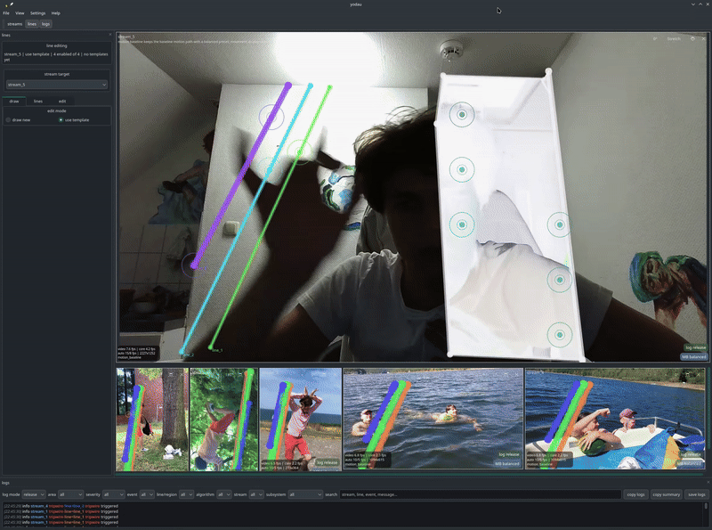
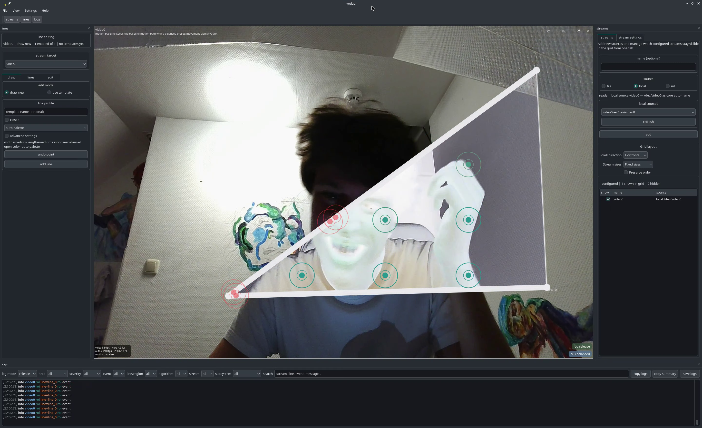
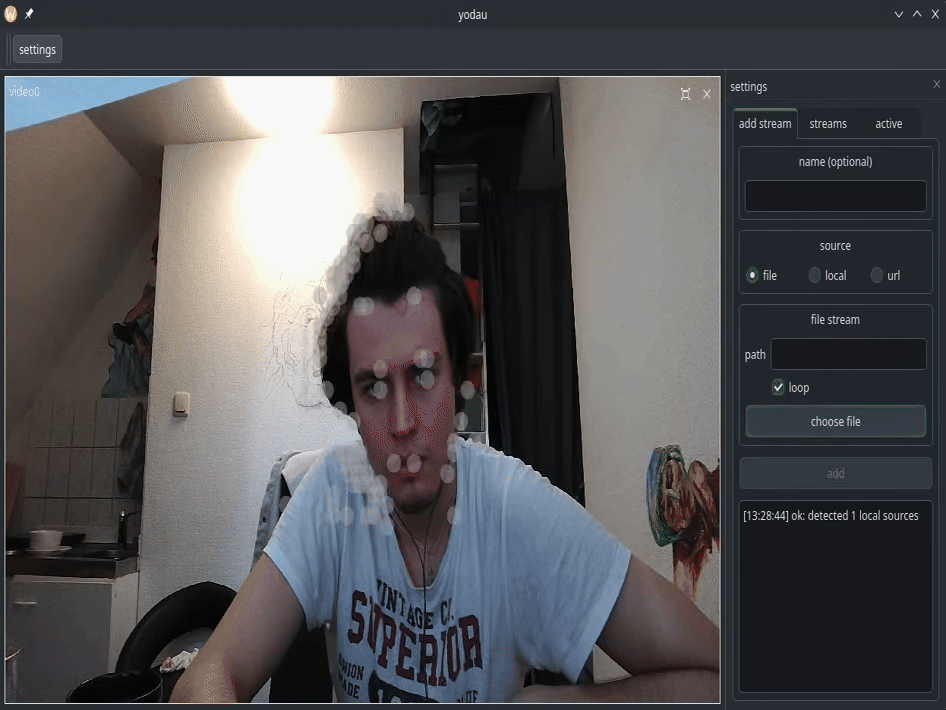

## Year of the Depend Adult Undergarment<a href="#ref-0">[0]</a>

#### Y.I.Riabtsev1

DOC: <a href="https://ninjaro.github.io/yodau/">ninjaro/yodau</a>

---
1 RWTH Aachen University, Aachen, North Rhine-Westphalia, Templergraben 55, 52056, Germany

---

**Abstract.** She said she would come. I thought she'd come by nine. I pulled the Venetian blinds on the one window
whose yellow light kept spilling across the floor and making it harder to just sit and wait. I could not quite focus:
even without headsets, Lou Reed kept coming in waves, sometimes murmuring that he is waiting for a
man<a href="#ref-1">[1]</a>, sometimes hitting my right ear so hard my whole body twisted up; I pressed my
palm against the ringing eardrum, unsure whether it was in the room or in me. Was there an insect, disappearing into the
narrow gap under the refrigerator door? I try not to come closer; I am afraid that if I really see it I will kill it,
and I do not want to kill anything tonight. She is probably at some factory-style opening, one of those white concrete
rooms where Warhol's ghosts play on a loop and Maria Beatty's slow, anachronistic frames stain the plaster - images that
barely move while the light on them changes<a href="#ref-3">[3]</a>. I half-remember that same roach crawling
across the frozen frames of Andy's *Empire*<a href="#ref-2">[2]</a>. Where was the woman who said she'd
come.<a href="#ref-0">[0]</a> Where is my muse.  
**Keywords:** cli, monitoring, surveillance, event-detection,
multistream, cpp23, qt6, stream-viewer.

**Index Terms**--waiting, strings, bubbles, noise, motion, decay, resonance.

### INFORMATION ABOUT THE AUTHORS

<table>
  <tr>
    <th><b>Yaroslav I. Riabtsev</b></th>
    <td>
      <a href="https://orcid.org/0000-0001-5530-3752">orcid.org/0000-0001-5530-3752</a>.
      E-mail:
      <a href="mailto:yaroslav.riabtsev@rwth-aachen.de">yaroslav.riabtsev@rwth-aachen.de</a>. 
      Master's student.
    </td>
  </tr>
</table>

  

## I. IN THE YODAU

**I / SHALL / KEEP WAITING** / if you don't mind  
**IN / THE / YO-DAU / I / SHALL**  
**KEEP WAITING** / if you decide / in the yodau.  
**I / SHALL / KEEP WAITING** / if you don't mind  
**I / SHALL / KEEP WAITING** / if you don't mind  
**I / SHALL / KEEP WAITING** / if you don't forget  
**IN / THE / YO-DAU / I / SHALL**  
**IN / THE / YO-DAU / I / SHALL**  
**KEEP WAITING** / if it's pouring down with rain<a href="#ref-6">[6]</a>   / in the yodau.

Das Zimmer liegt im Negativ.  
Ich bin in meinem Bild.  
In meinem weißen Atelier,  
zwischen Farben eingeklemmt,  
in der Enklave meiner Wahl,  
in der ich mich versteck.  
Im Yodau. See Fig. 1.<a href="#ref-7">[7]</a>  

 
<strong>Fig. 1.</strong> Negative. Made Feb. 11, 2026.

**I / SHALL / KEEP WAITING** / if you don't mind  
**IN / THE / YO-DAU / I / SHALL**  
**KEEP WAITING** / if you decide / in the yodau.  
**I / SHALL / KEEP WAITING** / if you don't mind  
**I / SHALL / KEEP WAITING** / if you don't mind  
**I / SHALL / KEEP WAITING** / if you don't forget  
**IN / THE / YO-DAU / I / SHALL**  
**IN / THE / YO-DAU / I / SHALL**  
**KEEP WAITING** / if it's pouring down with rain / in the yodau.  

I will be waiting for you through bubbles; see Fig. 2.  
continue waiting for you waiting in the bubbles  
waiting, waiting for their fall  
I will continue waiting for the bubbles to be ripened  
waiting, waiting for their fall  
I will continue waiting in the spring of *Homo bulla*.  

 
<strong>Fig. 2.</strong> Motion through bubbles.<a href="#ref-5">[5]</a>

I will continue waiting while the ash still holds its shape  
continue waiting until movement gives the shape away  
waiting, waiting for what is left to fall  
waiting for their fall  
waiting for their fall.  

**I / SHALL / KEEP WAITING** / if you don't mind  
**IN / THE / YO-DAU / I / SHALL**  
**KEEP WAITING** / if you decide / in the yodau.  
**I / SHALL / KEEP WAITING** / if you don't mind  
**I / SHALL / KEEP WAITING** / if you don't mind  
**I / SHALL / KEEP WAITING** / if you don't forget  
**IN / THE / YO-DAU / I / SHALL**  
**IN / THE / YO-DAU / I / SHALL**  
**KEEP WAITING** / if it's pouring down with rain / in the yodau.  

*Komm mich mal besuchen.*  
*Ich hab' unendlich Zeit.*<a href="#ref-7">[7]</a>  

## II. STRINGS

> *„Ich will keine Töne produzieren, es gibt doch schon genug. Ich will, dass etwas passiert.“*  
> 
— Blixa Bargeld<a href="#ref-8">[8]</a>

Okay, about the previous section.

It looks like *The Garden*, but in my head it goes more like *NNNAAAMMM*.<a href="#ref-10">[10]</a>

<strong>BAM / BAM / BAM</strong>   
something softer   
<strong>BAM / BAM / BAM</strong>   
something softer   
<strong>BAM / BAM / BAM</strong>   

That is about as far as I can explain music.

Naturally, I added strings.

I have no idea how to play them. Lou Reed tuned all the strings to one note and apparently that was enough,<a href="#ref-9">[9]</a> so I thought: fine, let's start with one string.

I tried.

It sounded like shit.

Same with circles on water: I expected some *bum* or *bummshhh* when the circle echoed with the wave, but it was lame.

The visual part stayed. A hit travels along the string, through bends, toward the ends, losing itself on the way.

 
<strong>Fig. 3.</strong> Still no sound. Much better.

**LOOKING FOR PEOPLE WHO UNDERSTAND THE NATURE OF STRINGS.**

There is already thickness, length, damping, hit strength, propagation in both directions, losses on bends and closed loops.

I can make the strings shake.

Someone else please make them sound good.

Physicists are welcome too. I assume string theory finally has a practical application.

## ACKNOWLEDGMENT

This work started as my personal deviation from the Qt;Athon 2025 Round 2 brief Option #1, curated with
Extenly.<a href="#ref-11">[11]</a>
Thanks to the Qt;Athon organizers and Extenly for the prompt.
I also thank the teammates who said "yes" to joining, but went unavailable/unreachable by the time I registered the
team - the project ended up solo.

## Conflict of Interest and Ethics

Conflict of Interest: the author declares no financial or institutional conflicts, except a fully disclosed personal
interest in the Qt;Athon 2025 prizes - a Steam Deck (512GB OLED), a 100€ Xbox gift card, and up to 4 hours of mentoring
from a Qt expert, with runner-up prizes being Qt Certification Test attempts.<a href="#ref-12">[12]</a>
This prize pool is the sole motivation for the project: I would rather win my Christmas shopping than do it myself.  
Ethics Statement: development and testing used a mix of self-recorded and third-party video streams.
All rights to third-party materials remain with their respective owners; no test media is redistributed with this
project.

## Not-DFW Footnotes

[0] D. F. Wallace, *Infinite Jest*, 1st ed. Boston, MA, USA: Little, Brown and Company, 1996, pp.
17-27.

[1] L. Reed, "I'm Waiting for the Man," in *The Velvet Underground & Nico* [LP]. New York, NY, USA:
Verve Records, 1967, track 2.

[2] A. Warhol and J. Palmer, *Empire* [Film]. USA: Andy Warhol Films, 1964, 485 min., black-and-white,
silent.

[3] M. Beatty, *Ecstasy in Berlin, 1926* [Video]. USA: Bleu Productions, 2004, 45 min.,
black-and-white and tinted, silent with music; DVD release, 2005.

[4] IEEE, *IEEE Editorial Style Manual*, Sec. "Abstract and Footnotes," consulted and disregarded,
Nov. 2025. [Online]. Available: https://journals.ieeeauthorcenter.ieee.org/wp-content/uploads/sites/7/IEEE-Editorial-Style-Manual-for-Authors.pdf

[5] ninjaro/yodau, "demos," GitHub Issue #23, opened Dec. 11, 2025, accessed Sep. 11, 2026. [Online]. Available: https://github.com/ninjaro/yodau/issues/23

[6] Einstürzende Neubauten, "The Garden," *Ende Neu*, official lyrics. [Online]. Available: https://neubauten.org/de/ende-neu-de/

[7] Einstürzende Neubauten, "Nagorny Karabach," *Alles Wieder Offen*, official lyrics. [Online]. Available: https://neubauten.org/de/alles-wieder-offen-de/

[8] B. Bargeld, quoted in J. Ziemer, “Einstürzende Neubauten: Die zarteste Versuchung, seit es Lärm gibt,” Der Spiegel, Mar. 31, 2000; reproduced by Humboldt Forum, “4. November 2004.” [Online]. Available: https://pdr.humboldtforum.org/4-november-2004/

[9] L. Reed and S. Sagmeister, interview, <i>Graphis</i>. [Online]. Available: https://www.loureed.com/features/sagmeister/loureed_sagmeister.pdf

[10] Einstürzende Neubauten, “NNNAAAMMM,” Ende Neu, official lyrics. [Online]. Available: https://neubauten.org/en/ende-neu/

[11] Qt Group, "Qt;Athon 2025 Round 2 Project Briefs - Option #1: Multi-Camera Surveillance (
Extenly)," competition instructions page, accessed Nov. 2025. [Online]. Available: https://www.qt.io/coding-comp-instructions-r2

[12] Qt Group, "Qt;Athon 2025," competition page. [Online]. Available: https://www.qt.io/qt-coding-competition-qtathon25
